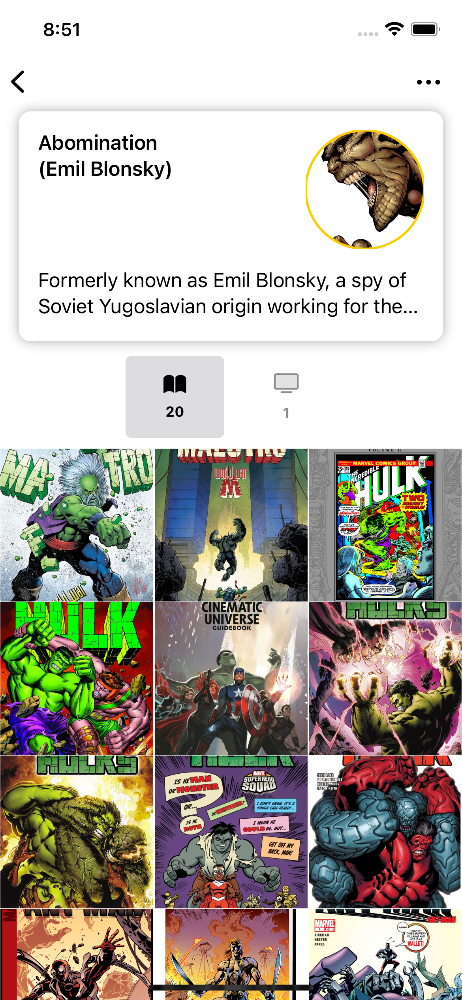

### Screenshots

|  |  |  |
| - | - | - |
|  |  |    |
|  |  |    |

### Implemented Requirements

The following requirements have been implemented:

- **Notice**: The server might without any data in Fetch today

### Code Explain

- **Generic JSON decode**: Leverages Swift `Generics` to handle fetching different response types from endpoints, allowing for flexibility and reusability.
- **Async/Await for Concurrent and Asynchronous Tasks**: `Async/await` functionality is utilized to manage concurrent and asynchronous tasks effectively.

- **Bar Approach**: Steps will sum up when multiple records fall within a given interval. For instance, if there are two records with 100 steps at 8:10 and 8:30, respectively, the bar representing 8:00 will display a combined 200 steps. This principle remains consistent for multiple records occurring within the same day. In the monthly view, the bar width adjusts dynamically, while in the daily and weekly views, the bar width remains fixed at 10 pixels.

